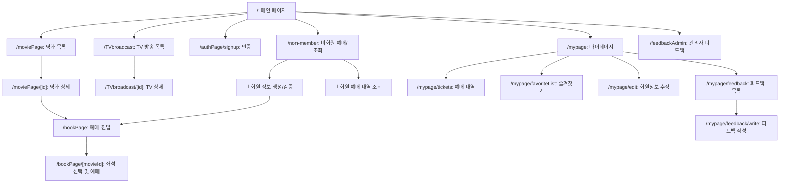

# 🎬 영화/TV 예매 웹 서비스


## 목차

- 프로젝트 개요
- 기술 스택
- 설계 구조
- 폴더 구조
- 핵심 기능
- 주요 API 엔드포인트 요약
- 유저 플로우 요약 (Mermaid)
- 인증 · 보안 설계
- 실행 방법
- 향후 개선 사항
- 라이선스

<br/>
<br/>

## 프로젝트 개요

신입 프론트엔드 포트폴리오용 프로젝트입니다.
유튜브 강의를 통해 학습한 영화/TV 데이터 조회와 즐겨찾기 기능을 참고하여
실제 서비스 흐름에 가까운 회원·비회원 예매, 마이페이지, 사용자/관리자 피드백 기능을 추가적으로 확장 구현했습니다.

현재 코드는 Next.js Pages Router 기반으로 구성되어 있으며,
`Model -> Repository -> Service -> API Route -> Container -> Presenter -> Page`
레이어를 따라 역할을 분리했습니다.

- 영화/TV 목록 및 상세 조회
- 회원/비회원 예매 흐름 분리
- 마이페이지 예매 내역 및 즐겨찾기 관리
- 사용자 피드백 작성/수정 및 관리자 응답 관리
- 예매 정책: 현재 1회 요청당 1좌석(`seats.length === 1`)

([포트폴리오 사이트 보러가기🔗 ](https://movie-ticket-project-theta.vercel.app/))<br/><br/>
<br/>
<br/>

## 기술 스택

**Frontend**<br/>


<br/>


**Backend / Infra**<br/>


<br/>


**Testing / Tooling**<br/>


<br/>
<br/>


## 설계 구조

본 프로젝트는 유지보수와 확장성을 고려해 레이어드 아키텍처와
Container/Presenter 패턴을 함께 사용했습니다.

```text
Model
 → Repository
   → Service
     → API Route
       → Container
         → Presenter
           → Page
```

- Container: 데이터 요청, 상태 관리, 이벤트 핸들링 담당
- Presenter: UI 렌더링 담당
- Service/Repository: 비즈니스 로직과 DB 접근 로직 분리
- API Route: 요청 검증 및 HTTP 경계 처리


**TanStack Query를 사용한 이유**

- 서버 상태 캐싱, 동기화, 재요청 제어를 일관되게 다루기 위해 사용했습니다.
- 로딩/에러/갱신 상태 처리를 표준화하기 위해 사용했습니다.

**NextAuth를 사용한 이유**

- Credentials와 소셜 로그인(Kakao/Naver)을 하나의 인증 프레임워크에서 통합 관리하기 위해 사용했습니다.
- JWT 세션 전략과 콜백 기반 role 확장을 통해 인증/인가 구조를 명확히 드러내기 위해 사용했습니다.

**MongoDB를 사용한 이유**

- 예매, 좌석, 피드백, 즐겨찾기처럼 성격이 다른 데이터를 유연하게 모델링하기 위해 사용했습니다.
- Repository 계층과 결합해 조회/통계/마이그레이션 확장에 빠르게 대응하기 위해 사용했습니다.

**Sentry를 사용한 이유**

- 클라이언트/서버/엣지 오류를 함께 수집해 문제 재현과 에러발생시 신속한 대응이 가능한지 확인해보고 싶었습니다.
- 포트폴리오에서도 운영 관점의 관측성 구성을 포함했음을 보여주기 위해 사용했습니다.

<br/>
<br/>
## 폴더 구조

```text
.
├── pages/
│   ├── index.tsx
│   ├── 404.tsx
│   ├── _app.tsx
│   ├── _document.tsx
│   ├── _error.tsx
│   ├── authPage/
│   ├── bookPage/
│   ├── feedbackAdmin/
│   ├── moviePage/
│   ├── mypage/
│   ├── non-member/
│   ├── TVbroadcast/
│   ├── sentry-example-page.tsx
│   └── api/
│       ├── adminFeedback/
│       ├── auth/
│       ├── booking/
│       ├── bookingFetchMovies/
│       ├── favorite/
│       ├── movies/
│       ├── non-member/
│       ├── profile/
│       ├── search/
│       ├── sentry-example-api.ts
│       ├── showtimes/
│       ├── top-rated/
│       └── TV/
├── src/
│   ├── components/
│   │   ├── hoc/
│   │   ├── presenters/
│   │   └── utils/
│   ├── containers/
│   ├── repositories/
│   └── services/
├── lib/
├── queries/
├── scripts/
├── tests/
├── types/
├── docs/
├── middleware.ts
├── instrumentation.ts
├── next.config.js
├── playwright.config.ts
└── jest.config.cjs
```

- `moviePage`, `TVbroadcast`는 미디어 타입별 화면을 분리한 라우트입니다.
- `docs/`는 JSDoc 생성 결과물입니다.

<br/>
<br/>

## 핵심 기능

#### 강의 기반 학습 및 적용 기능

- TMDB API 연동을 통한 영화/TV 데이터 조회 및 상세 페이지 구성
- MongoDB를 활용한 기본적인 즐겨찾기 기능

#### 추가 확장 기능

- 회원 예매
  - 좌석 선택 후 예매 생성
  - 마이페이지에서 예매 내역 조회
- 비회원 예매
  - 비회원 정보를 생성하거나 기존 정보를 재사용한 뒤 `/bookPage?bookingId=...`로 이동
  - 영화 선택 이후 `/bookPage/[movieId]?bookingId=...` 형태로 예매 진행
  - 이름/생년월일/전화번호/비밀번호 조합으로 예매 내역 조회
- 즐겨찾기
  - 영화/TV 타입별 목록 관리
- 마이페이지
  - 프로필 수정
  - 즐겨찾기 관리
  - 예매 내역 확인
  - 피드백 작성/조회/수정
- 관리자 피드백
  - 목록/상세 조회
  - 상태 변경
  - 답글 생성/수정/삭제(소프트 삭제)
 

    
- 통합 검색 및 상영 시간/좌석 조회

### 주요 API 엔드포인트 요약

- `POST /api/auth/signup` - 회원가입
- `GET /api/movies/fetchMovies` - 영화 목록 조회
- `GET /api/movies/:id` - 영화 상세 조회
- `GET /api/TV` - TV 목록 조회
- `GET /api/TV/:id` - TV 상세 조회
- `GET /api/search` - 통합 검색
- `GET /api/top-rated` - 홈 상단 추천/영상 데이터
- `GET /api/bookingFetchMovies` - 예매 진입용 영화 목록
- `POST /api/booking` - 회원/비회원 예매 생성(1좌석 정책)
- `GET /api/booking/:id` - 예매 영수증/상세 조회
- `GET /api/booking/myPageList` - 회원 예매 목록 조회
- `GET /api/showtimes` - 상영 시간 조회
- `GET /api/showtimes/exists` - 상영 가능 여부 확인
- `GET /api/showtimes/:id/seat` - 좌석 조회
- `POST /api/non-member/create` - 비회원 생성 또는 기존 비회원 조회 후 `nonMemberId` 반환
- `POST /api/non-member/search` - 비회원 예매 내역 조회
- `POST /api/favorite/add` - 즐겨찾기 추가
- `DELETE /api/favorite/remove` - 즐겨찾기 제거
- `GET /api/favorite/status` - 즐겨찾기 상태/목록 조회
- `PUT /api/profile/update` - 프로필 수정
- `GET/POST /api/profile/feedback` - 피드백 조회/생성
- `PATCH /api/profile/feedback/edit/:id` - 피드백 수정
- `GET /api/adminFeedback` - 관리자 피드백 목록
- `GET/PATCH /api/adminFeedback/:id` - 관리자 피드백 상세 조회/상태 변경
- `GET /api/adminFeedback/stats` - 피드백 통계
- `GET /api/adminFeedback/status` - 상태별 집계
- `POST /api/adminFeedback/:id/response` - 관리자 답글 생성
- `PATCH/DELETE /api/adminFeedback/:id/response/:rid` - 관리자 답글 수정/삭제

### 유저 플로우 요약 (Mermaid)



<br/>
([개인 벨로그 링크](https://velog.io/@jh_000velog/%EC%98%81%ED%99%94-%EC%98%88%EB%A7%A4-%EC%82%AC%EC%9D%B4%ED%8A%B8-%EC%9C%A0%EC%A0%80%ED%94%8C%EB%A1%9C%EC%9A%B0))
<br/>
<br/>

## 인증 · 보안 설계

- NextAuth 기반 JWT 세션 전략
- 제공자: Credentials / Kakao / Naver
- 역할(Role): `user`, `admin`
- 소셜 계정 식별값은 `SOCIAL_PEPPER_HMAC_SECRET`로 HMAC 해시하여 저장
- 관리자 권한은 `ADMIN_EMAILS` 기반 분기와 DB role 값을 함께 반영
- 미들웨어 보호 대상
  - `/mypage/*` 인증 필요 (`reason=auth`)
  - `/feedbackAdmin/*` 관리자 권한 필요 (`reason=admin`)
- `/bookPage`는 비회원 예매 지원을 위해 미들웨어 강제 보호 대상에서 제외
- 비밀번호 저장 시 `bcryptjs` 해시 적용

<br/>
<br/>

## 실행 방법

1. 환경 변수 파일 구분
   - `.env.local`: 로컬 개발용 실제 런타임 변수 파일
   - `.env.deploy.example`: 배포/런타임 변수 템플릿 예시 파일
   - `.env.sentry-build-plugin.example`: Sentry source map 업로드용 토큰 템플릿 예시 파일
   - `.env.sentry-build-plugin`: 필요할 때만 로컬에 두는 실제 Sentry 빌드 토큰 파일

2. 로컬 개발용 환경 변수 작성

   `.env.deploy.example`를 참고해 `.env.local` 파일을 직접 생성하고 아래 키를 채웁니다.

   ```bash
   MONGODB_URI=
   NEXTAUTH_URL=http://localhost:3000
   NEXTAUTH_SECRET=
   NEXT_PUBLIC_API_URL=https://api.themoviedb.org/3/
   NEXT_PUBLIC_IMAGE_BASE_URL=https://image.tmdb.org/t/p/
   API_SECRET_KEY=
   KAKAO_CLIENT_ID=
   KAKAO_CLIENT_SECRET=
   NAVER_CLIENT_ID=
   NAVER_CLIENT_SECRET=
   ADMIN_EMAILS=
   SOCIAL_PEPPER_HMAC_SECRET=
   SENTRY_DSN=
   ```

   배포/런타임 템플릿이 필요하면 `.env.deploy.example`를 참고하고,
   로컬 실행은 같은 키를 `.env.local`에 맞게 채워 사용하면 됩니다.

3. 배포/빌드 환경 변수 분리
   - 위 런타임 변수는 Vercel 같은 배포 플랫폼 환경 변수에도 동일하게 등록합니다.
   - 배포 환경의 `NEXTAUTH_URL`은 실제 서비스 도메인으로 지정합니다.
   - Sentry source map 업로드를 사용한다면 `.env.sentry-build-plugin.example`를 참고해 `.env.sentry-build-plugin`을 만들거나, `SENTRY_AUTH_TOKEN`을 배포 환경 변수에 직접 설정합니다.
   - 저장소에는 추적 가능한 템플릿 파일로 `.env.deploy.example`, `.env.sentry-build-plugin.example`를 함께 제공합니다.

4. 의존성 설치

   `yarn install`

5. 개발 서버 실행

   `yarn dev`

6. 선택 실행
   - 타입체크: `yarn tsc --noEmit`
   - 단위 테스트: `yarn test`
   - E2E 테스트: `yarn playwright test`
   - 영화/상영 시드: `yarn seed`
   - 피드백 마이그레이션: `yarn migrate`
   - JSDoc 생성: `yarn jsdoc`

<br/>
<br/>

## 향후 개선 사항

- 실제 PG사 결제 연동
- 예매 취소/환불 워크플로우 개선

<br/>
<br/>

## 라이선스

This project is licensed under the MIT License.
본 프로젝트는 TMDB API를 사용합니다.<br/>
John-Ahn 님의 강의를 참고하여 확장한 코드입니다. ([📺유튜브링크](https://www.youtube.com/watch?v=RxPJeeEgdIs&t=1s))<br/>
프로젝트의 코드를 참고하거나 일부를 사용하는 경우
GitHub 저장소 링크 또는 작성자(groguJH/junghwa)를 출처로 남겨주시면 감사하겠습니다.<br/>
